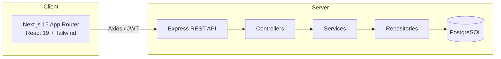
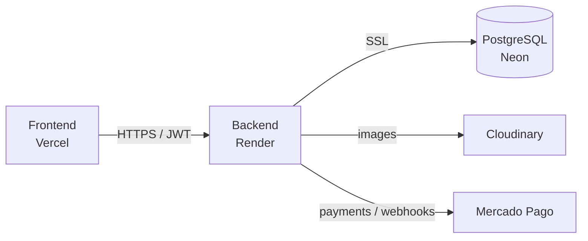

# 🎸 SoundNest

> Full-stack e-commerce for musical instruments — browse the catalog, register, log in, manage a persistent cart and place stock-validated orders.

[](https://www.typescriptlang.org/)
[](https://nextjs.org/)
[](https://react.dev/)
[](https://nodejs.org/)
[](https://expressjs.com/)
[](https://www.postgresql.org/)
[](https://typeorm.io/)
[](https://tailwindcss.com/)
[](https://jwt.io/)
[](./LICENSE)

🔗 **Live demo:** https://soundnest-musicstore-git-main-alefalces-projects.vercel.app

---

## Table of contents

- [Features](#features)
- [Tech stack](#tech-stack)
- [Architecture](#architecture)
- [API reference](#api-reference)
- [Getting started](#getting-started)
- [Running with Docker](#running-with-docker)
- [Testing](#testing)
- [Project structure](#project-structure)
- [License](#license)

---

## Features

- 🔐 **JWT authentication** with bcrypt-hashed passwords and role-based access
- 👤 User registration and login
- 🛒 **Persistent cart** saved per user in the backend
- 💳 **Mercado Pago Checkout Pro** (test mode) — pay from the cart, with
  server-to-server **webhooks** (signed, idempotent) creating the order
- 🛠️ **Admin panel** — product CRUD, stock/price/category editing, and
  **Cloudinary image uploads**
- 📦 Stock validation on checkout
- 🔒 Protected private routes
- 🧾 Order history
- 🔎 Paginated catalog with search and category filters
- ✅ Friendly confirmations (SweetAlert2) and toasts
- 📱 Responsive design with light/dark mode

---

## Tech stack

| Layer       | Technologies                                                                 |
| ----------- | ---------------------------------------------------------------------------- |
| **Frontend**| Next.js 15 (App Router) · React 19 · TypeScript · Tailwind CSS 4 · Axios · SweetAlert2 · React Toastify · Lucide |
| **Backend** | Node.js · Express · TypeScript · TypeORM · PostgreSQL · JWT · Bcrypt · Mercado Pago · Cloudinary |
| **Tooling** | Jest · Supertest · Swagger · GitHub Actions · Docker                          |
| **Deploy**  | Vercel (frontend) · Render (backend) · Neon (PostgreSQL)                      |

---

## Architecture



### Data model

```mermaid
erDiagram
    USER ||--|| CREDENTIAL : has
    USER ||--o{ ORDER : places
    ORDER }o--o{ PRODUCT : contains
    PRODUCT }o--|| CATEGORY : belongs_to

    USER { int id string name string email string address string phone }
    CREDENTIAL { int id string password }
    PRODUCT { int id string name string description number price int stock string image }
    CATEGORY { int id string name }
    ORDER { int id date date }
```



---

## API reference

Interactive docs are served at **`/api-docs`** (Swagger UI) — **live at
[e-comerce-l5gu.onrender.com/api-docs](https://e-comerce-l5gu.onrender.com/api-docs)**
(the first request may take a moment to wake the free instance).

| Method | Endpoint          | Auth | Notes                              |
| ------ | ----------------- | :--: | ---------------------------------- |
| POST   | `/users/register` |  ❌  | Validated by DTO middleware        |
| POST   | `/users/login`    |  ❌  | Returns `{ login, user, token }`   |
| POST   | `/users/orders`   |  ✅  | List the current user's orders     |
| GET    | `/products`       |  ❌  | List products                      |
| GET    | `/products/:id`   |  ❌  | Single product                     |
| POST   | `/products/image` |  ✅  | Admin: upload an image to Cloudinary → `{ url }` |
| POST   | `/orders`         |  ✅  | Create order, validates stock      |
| POST   | `/payments/create-preference` | ✅ | Mercado Pago: build a Checkout Pro preference → `{ id, init_point }` |
| GET    | `/payments/confirm?payment_id=` | ✅ | Verify the payment vs MP; if approved, create the order (idempotent) |
| POST   | `/payments/webhook` | ❌ | Mercado Pago server-to-server notification; verifies the `x-signature` and creates the order |

> Auth: send the JWT in the `Authorization` header (no `Bearer` prefix).

### Payments (test mode)

Checkout runs on **Mercado Pago Checkout Pro** in sandbox mode. From the cart the
frontend calls `create-preference` and redirects the buyer to `init_point`; on
return, the success page calls `confirm`, which verifies the payment against
Mercado Pago and creates the order from the preference metadata (idempotent via a
nullable `Order.paymentId`).

To try it you need test **credentials** (`MP_ACCESS_TOKEN`) and a Mercado Pago
**test user** as the buyer (a real account triggers *"una de las partes es de
prueba"*). On `localhost` Mercado Pago shows no return button and no `auto_return`,
so confirm manually by opening `/checkout/success?payment_id=<id>`. Setting
`FRONTEND_URL` to the https Vercel URL enables `auto_return` in production.

#### Webhooks (`/payments/webhook`)

So order creation no longer depends on the browser returning, Mercado Pago also
notifies the backend server-to-server. The preference advertises a
`notification_url` (`${BACKEND_URL}/payments/webhook`) **only when `BACKEND_URL`
is a public https URL** — otherwise it's omitted and the browser-driven `confirm`
flow stays as the fallback. The endpoint is public (MP can't send a JWT): it
verifies the `x-signature` header against `MP_WEBHOOK_SECRET`, then reuses the same
idempotent verify-and-create logic as `confirm`, and always acks `200`.

To exercise it locally, expose the backend with a tunnel (e.g. ngrok):

```bash
ngrok http 8080
# set BACKEND_URL to the https tunnel URL and MP_WEBHOOK_SECRET to the secret
# from the Mercado Pago panel, then restart the backend
```

Without a tunnel everything still works through the browser `confirm` flow; the
webhook is simply not wired.

---

## Getting started

### Prerequisites

- Node.js 20+
- PostgreSQL 14+

### 1. Clone

```bash
git clone https://github.com/AleFalces/SonNest-Music.git
cd SonNest-Music
```

### 2. Backend

```bash
cd back
cp .env.example .env   # then fill in the values
npm install
npm run dev            # http://localhost:8080
```

### 3. Frontend

```bash
cd Front/my-app
cp .env.example .env.local   # then fill in the values
npm install
npm run dev                  # http://localhost:3000
```

On boot the backend auto-seeds the categories and products.

> For checkout, set `MP_ACCESS_TOKEN` (Mercado Pago test access token) and
> `FRONTEND_URL` (base for the return URLs) in `back/.env`.

---

## Running with Docker

Spin up database, backend and frontend with a single command:

```bash
docker compose up --build
```

- Frontend → http://localhost:3000
- Backend → http://localhost:8080
- Swagger → http://localhost:8080/api-docs

---

## Testing

```bash
cd back
npm test          # run the Jest + Supertest suite
npm run test:cov  # with coverage
```

---

## Deployment

The app runs fully in the cloud:



- **Frontend** → Vercel. Set `NEXT_PUBLIC_API_URL` to the Render backend URL
  (it is inlined at build time, so a redeploy is required after changing it).
- **Backend** → Render (Node 20, `npm run build` + `npm start`).
- **Database** → Neon (managed Postgres). The production datasource connects over
  SSL; set `DB_SYNCHRONIZE=true` on the first boot so the schema is created and the
  catalog seeds, then it can be turned off.

Backend environment variables in production:

| Variable | Purpose |
| -------- | ------- |
| `NODE_ENV` | `production` (selects the production datasource) |
| `DATABASE_URL` | Neon connection string (`...?sslmode=require`) |
| `DB_SYNCHRONIZE` | `true` on first boot to create the schema, then `false` |
| `JWT_SECRET` | token signing secret |
| `MP_ACCESS_TOKEN` | Mercado Pago access token |
| `FRONTEND_URL` | the https Vercel URL (enables payment `auto_return`) |
| `CLOUDINARY_CLOUD_NAME` / `CLOUDINARY_API_KEY` / `CLOUDINARY_API_SECRET` | image uploads |
| `BACKEND_URL` / `MP_WEBHOOK_SECRET` | public backend URL + secret for payment webhooks |

> The free Render instance sleeps after inactivity, so the first request after an
> idle period can take a little longer to wake the service.

---

## Project structure

```
SonNest-Music/
├── back/                 # Express + TypeORM REST API
│   └── src/
│       ├── config/       # envs, dataSource
│       ├── controllers/  # HTTP layer
│       ├── services/     # business logic
│       ├── repositories/ # TypeORM data access
│       ├── entities/     # User, Credential, Product, Category, Order
│       ├── dtos/         # data transfer objects
│       ├── middlewares/  # validation + auth
│       ├── docs/         # Swagger spec
│       └── routes/       # users / products / orders routers
└── Front/my-app/
    └── src/
        ├── app/          # App Router pages
        ├── components/   # UI components
        ├── services/     # Axios API clients
        ├── interfaces/   # shared TS types
        ├── hooks/        # custom hooks
        └── helpers/      # validations + utils
```

---

## License

Released under the [MIT License](./LICENSE).

---

<p align="center">Built with ❤️ by <a href="https://github.com/AleFalces">Ale Falces</a></p>
