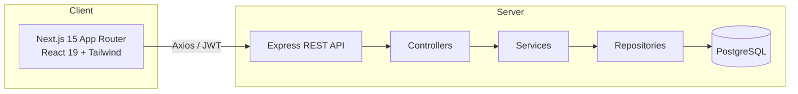
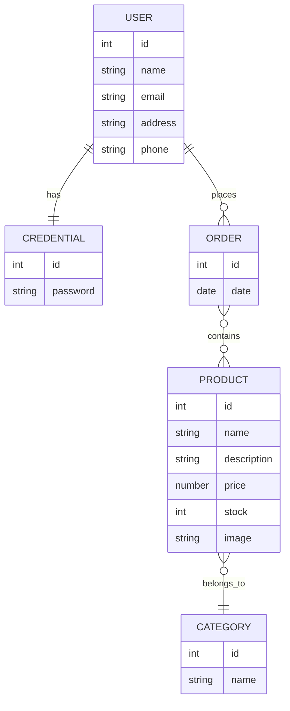

# 🎸 SoundNest

> Full-stack e-commerce for musical instruments — browse the catalog, register, log in, manage a persistent cart and place stock-validated orders.

[](https://www.typescriptlang.org/)
[](https://nextjs.org/)
[](https://react.dev/)
[](https://nodejs.org/)
[](https://expressjs.com/)
[](https://www.postgresql.org/)
[](https://typeorm.io/)
[](https://tailwindcss.com/)
[](https://jwt.io/)
[](./LICENSE)

🔗 **Live demo:** https://soundnest-musicstore-git-main-alefalces-projects.vercel.app

---

## Table of contents

- [Features](#features)
- [Tech stack](#tech-stack)
- [Architecture](#architecture)
- [API reference](#api-reference)
- [Getting started](#getting-started)
- [Running with Docker](#running-with-docker)
- [Testing](#testing)
- [Project structure](#project-structure)
- [License](#license)

---

## Features

- 🔐 **JWT authentication** with bcrypt-hashed passwords
- 👤 User registration and login
- 🛒 Persistent cart (LocalStorage)
- 📦 Stock validation on checkout
- 🔒 Protected private routes
- 🧾 Basic order history
- 🔎 Filtering by name and category
- ✅ Friendly confirmations (SweetAlert2)
- 📱 Responsive design

---

## Tech stack

| Layer       | Technologies                                                                 |
| ----------- | ---------------------------------------------------------------------------- |
| **Frontend**| Next.js 15 (App Router) · React 19 · TypeScript · Tailwind CSS 4 · Axios · SweetAlert2 · React Toastify · Lucide |
| **Backend** | Node.js · Express · TypeScript · TypeORM · PostgreSQL · JWT · Bcrypt          |
| **Tooling** | Jest · Supertest · Swagger · GitHub Actions · Docker                          |
| **Deploy**  | Vercel (frontend) · Render (backend)                                          |

---

## Architecture



### Data model



---

## API reference

Interactive docs are served at **`/api-docs`** (Swagger UI) when the backend is running.

| Method | Endpoint          | Auth | Notes                              |
| ------ | ----------------- | :--: | ---------------------------------- |
| POST   | `/users/register` |  ❌  | Validated by DTO middleware        |
| POST   | `/users/login`    |  ❌  | Returns `{ login, user, token }`   |
| POST   | `/users/orders`   |  ✅  | List the current user's orders     |
| GET    | `/products`       |  ❌  | List products                      |
| GET    | `/products/:id`   |  ❌  | Single product                     |
| POST   | `/orders`         |  ✅  | Create order, validates stock      |

> Auth: send the JWT in the `Authorization` header (no `Bearer` prefix).

---

## Getting started

### Prerequisites

- Node.js 20+
- PostgreSQL 14+

### 1. Clone

```bash
git clone https://github.com/AleFalces/E-comerce.git
cd SonNest-Music
```

### 2. Backend

```bash
cd back
cp .env.example .env   # then fill in the values
npm install
npm run dev            # http://localhost:8080
```

### 3. Frontend

```bash
cd Front/my-app
cp .env.example .env.local   # then fill in the values
npm install
npm run dev                  # http://localhost:3000
```

On boot the backend auto-seeds the categories and products.

---

## Running with Docker

Spin up database, backend and frontend with a single command:

```bash
docker compose up --build
```

- Frontend → http://localhost:3000
- Backend → http://localhost:8080
- Swagger → http://localhost:8080/api-docs

---

## Testing

```bash
cd back
npm test          # run the Jest + Supertest suite
npm run test:cov  # with coverage
```

---

## Project structure

```
SonNest-Music/
├── back/                 # Express + TypeORM REST API
│   └── src/
│       ├── config/       # envs, dataSource
│       ├── controllers/  # HTTP layer
│       ├── services/     # business logic
│       ├── repositories/ # TypeORM data access
│       ├── entities/     # User, Credential, Product, Category, Order
│       ├── dtos/         # data transfer objects
│       ├── middlewares/  # validation + auth
│       ├── docs/         # Swagger spec
│       └── routes/       # users / products / orders routers
└── Front/my-app/
    └── src/
        ├── app/          # App Router pages
        ├── components/   # UI components
        ├── services/     # Axios API clients
        ├── interfaces/   # shared TS types
        ├── hooks/        # custom hooks
        └── helpers/      # validations + utils
```

---

## License

Released under the [MIT License](./LICENSE).

---

<p align="center">Built with ❤️ by <a href="https://github.com/AleFalces">Ale Falces</a></p>
